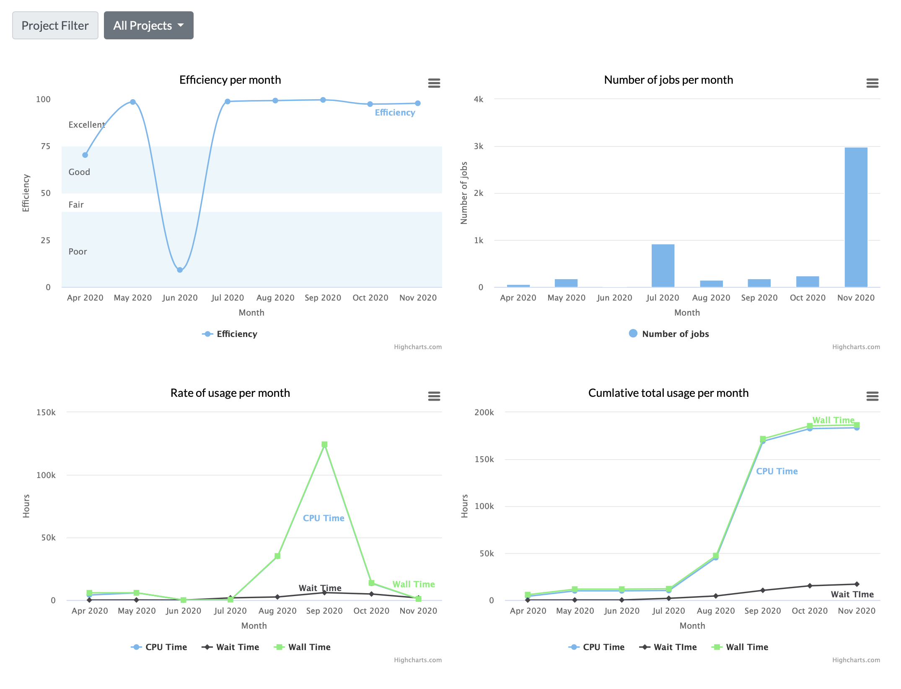
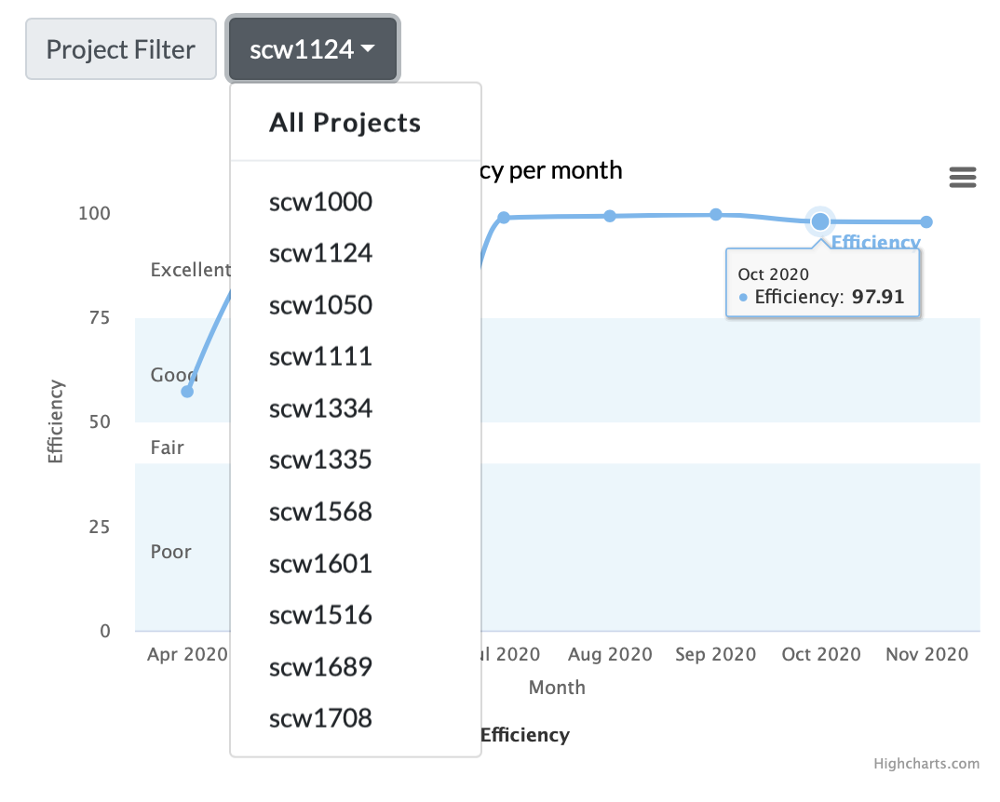
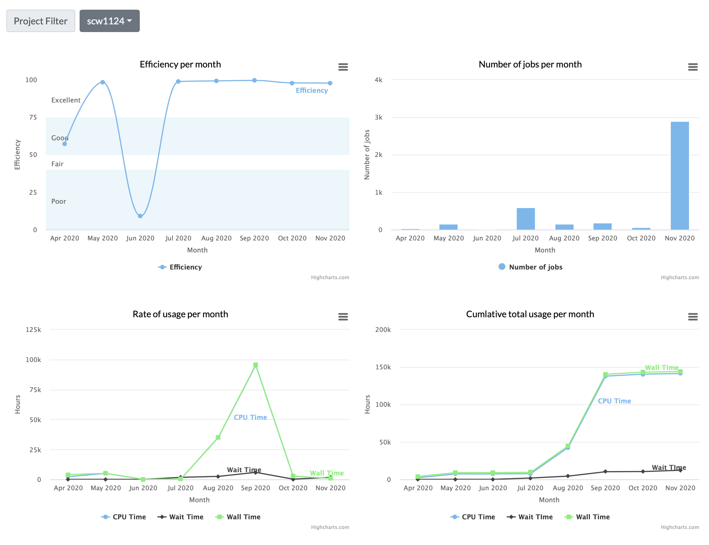

# cogs3

* [Deployment](#deployment)
* [User Guide](#user-guide)
  * [User](#user)
  * [Technical Lead](#technical-leads)
  * [Staff](#staff)
  * [Administrators](#administrators)


## Deployment

## Bangor

1. Switch to `arcca` branch

    ```git checkout arcca```

2. Source environment.

    ```source /path/to/vennv```

3. Run database migrations.

    ```python3 manage.py migrate```

4. Load data fixtures.

    ```
    python3 manage.py loaddata \
       access_methods.json \
       applications.json \
       os.json \
       hardware_groups.json \ 
       partitions.json
    ```

5. Load in historical data

**Import daily compute**

    python3 manage.py import_historical_daily_compute \
       --input_dir= \
       --output_dir=

**Import daily compute ligo**

    python3 manage.py import_historical_daily_compute_ligo \
       --input_dir= \
       --output_dir=

**Import user last login**

    python3 manage.py import_historical_user_last_login \
       --input_dir= \
       --output_dir=

**Import weekly storage**

    python3 manage.py import_historical_weekly_storage \
       --input_dir= \
       --output_dir=

## User Guide

### User

Users identified as not being a technical lead of a project, such as an institutional or external user can view the last 12 months of their compute usage on SCW. 

Upon successful login to MySCW, the default view of the homepage will render charts of various compute metrics.

<p align="center">
    
</p>
  
By default, the charts will display the cumulative totals of a users usage for the projects in which a user has a valid project membership. A user can filter the results on a per-project basis by selecting the ‘Project Filter’ dropdown option and selecting a project.

<p align="center">
    
</p>

<p align="center">
    
</p>
  
### Technical Leads

### Staff

### Administrators

#### Data Import

**Find date range of LIGO file.**

   ```
   python3 manage.py find_date_range_of_ligo_file \
      --file=path_to_ligo_log_file.out
   ```

**Import LIGO daily compute stats.**
    
   ```
   python3 manage.py import_daily_compute_ligo \
      --file=path_to_stats_file.out
      -d 31 \
      -m 10 \
      -y 2020 \
      -s CF
   ```

**Import daily compute stats.**
    
   ```
   python3 manage.py import_daily_compute \
      --file=path_to_stats_file.out
      -d 31 \
      -m 10 \
      -y 2020 \
      -s CF
   ```

**Import user last login stats.**

   ```
   python3 manage.py import_user_last_login \
      --file=path_to_user_last_login.csv
   ```

**Import weekly storage stats.**

   ```
   python3 manage.py import_weekly_storage \
      --homefile=path_to_home_file.csv \
      --scratchfile=path_to_scratch_file.csv \
      -d 21 \
      -m 11 \
      -y 2020 \
      -s CF
   ```
